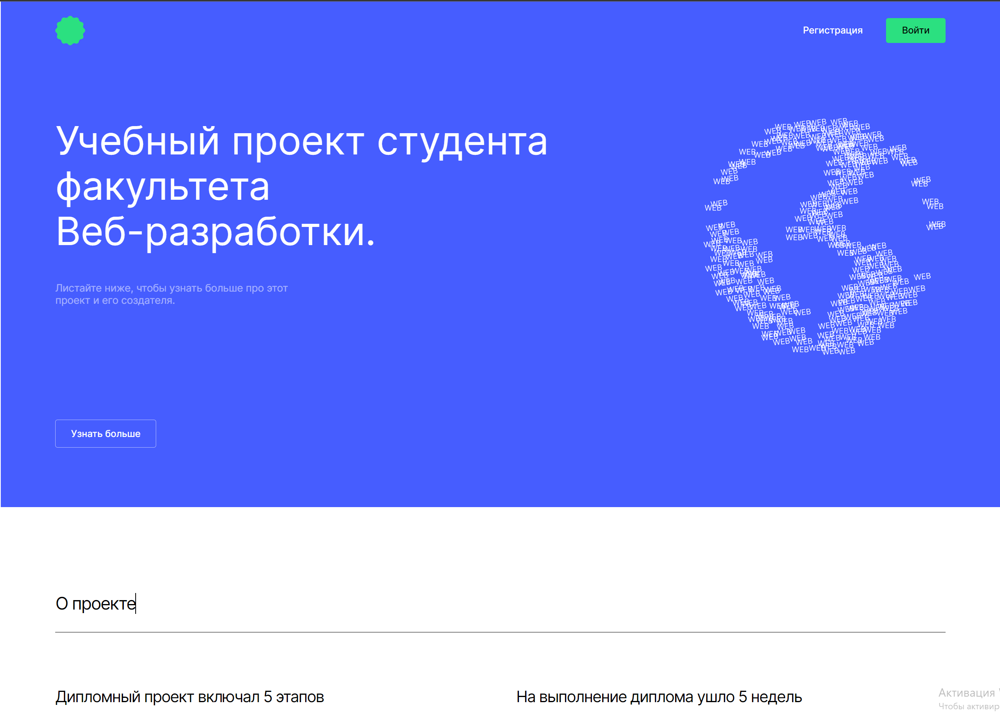
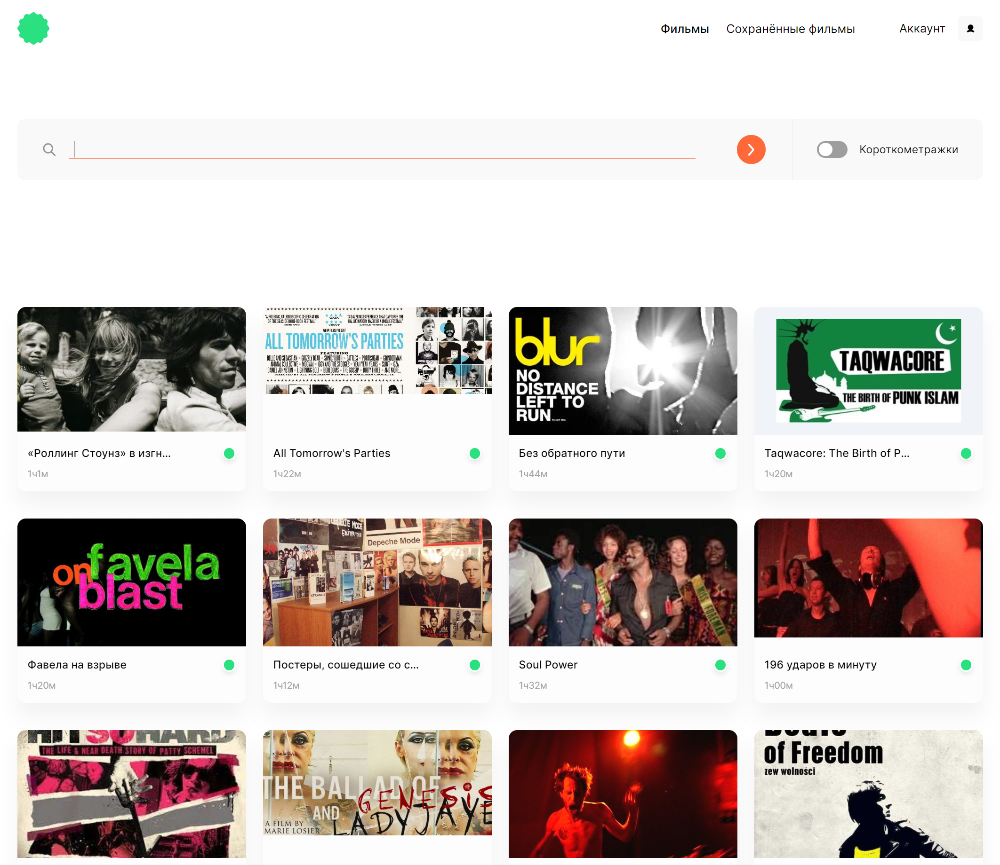
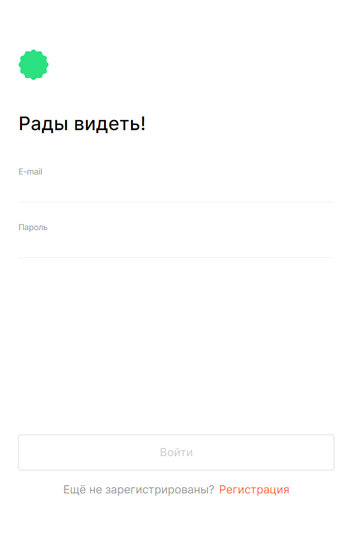

# movies-explorer-frontend
#### Ссылка на сайт: https://skor.nomoredomains.monster


## Описание и функциональность проекта
### Frontend

- Свёрстаны компоненты в соответствии макету 
- На сайте реализована регистрация, авторизация и редактирование профиля пользователя
- Был проработан механизм сохранения фильмов в профиле. 
- Полученные фильмы фильтруются на стороне клиента.
- Также были выполнены асинхронные GET- и POST-запросы к API. 

###   Backend
- Был создан сервер на express.
- Подключена база данных MongoDB, созданы схемы и модели ресурсов API. 
- Реализованы механизмы логирования, аутентификации и авторизации на сервере.
- Бэкенд задеплоен на виртуальную машину.

Начальная страница | Фильмы | Авторизация
:---: | :---: | :---:
[](https://skor.nomoredomains.monster) | | 


## Стэк технологий

| <a href="https://html.spec.whatwg.org/multipage/" target="_blank" rel="noreferrer"></a> | <a href="https://www.w3schools.com/css/" target="_blank" rel="noreferrer"></a> | <a href="https://react.dev/" target="_blank" rel="noreferrer"></a> | <a href="https://expressjs.com/" target="_blank"></a> | <a href="https://nodejs.org/" target="_blank"></a> | <a href="https://www.mongodb.com/" target="_blank"></a> |
| :---: | :---: | :---: | :---: | :---: | :---: |
| HTML | CSS  | React | Express | Node.js | MongoDB |

<br>


## Запуск проекта

клонировать репозиторий 

```javascript
git clone https://github.com/Balzak1976/movies-explorer-frontend
```

установить зависимости

```javascript
npm ci 
```
запуск проекта в режиме разработки ( адрес: `http://localhost:3000` )

```javascript
npm run start 
```
создать финальную сборку ( папка `build` )

```javascript
npm run build 
```