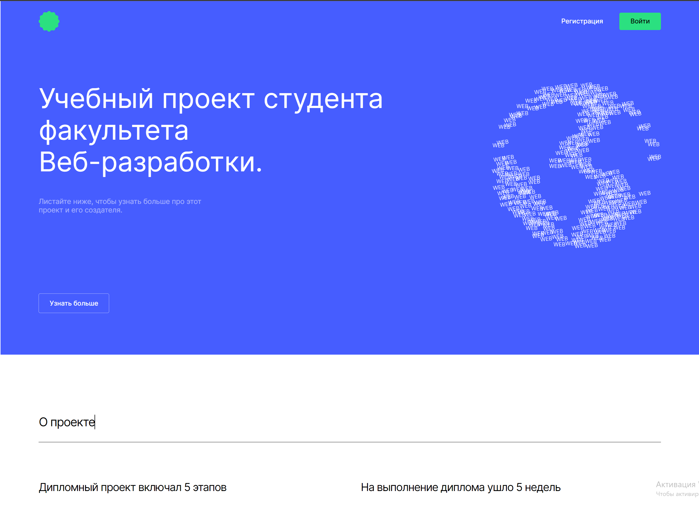
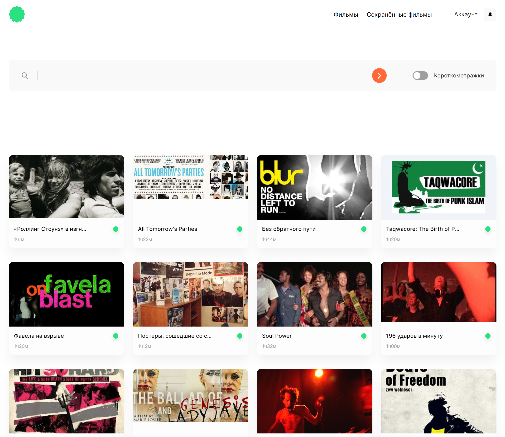
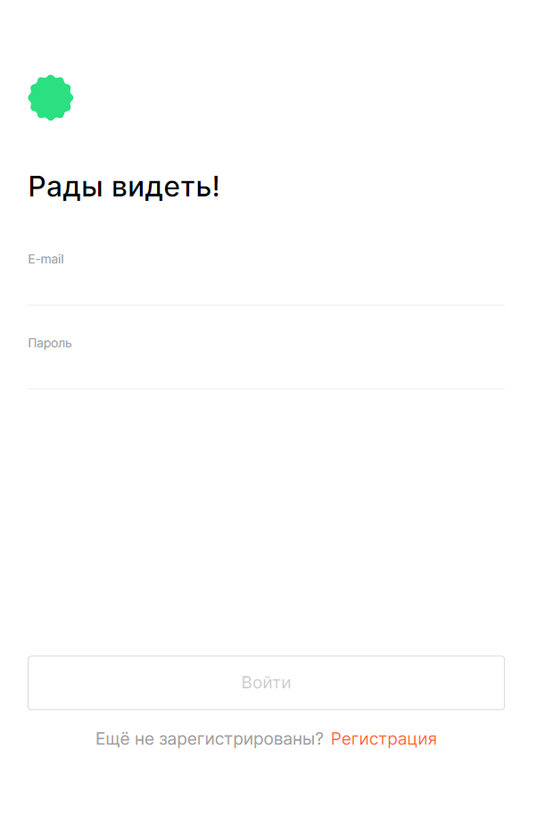

# movies-explorer-frontend

<table>
<colgroup>
<col>
<col>
<col>
<col>
<col>
<col>
</colgroup>
<thead>
    <th colspan="6">Стек и технологии</th>
  </tr>
</thead>
<tbody>
  <tr>
    <td colspan="3">Frontend</td>
    <td colspan="3">Backend</td>
  </tr>
  <tr>
    <td>React</td>
    <td>HTML</td>
    <td>CSS</td=>
    <td>Express</td=>
    <td>Node.js</td=>
    <td>MongoDB</td=>
  </tr>
</tbody>
</table>


## Описание и функциональность проекта
### Frontend

- Свёрстаны компоненты в соответствии макету 
- На сайте реализована регистрация, авторизация и редактирование профиля пользователя
- Был проработан механизм сохранения фильмов в профиле. 
- Полученные фильмы фильтруются на стороне клиента.
- Также были выполнены асинхронные GET- и POST-запросы к API. 

###   Backend
- Был создан сервер на express.
- Подключена база данных MongoDB, созданы схемы и модели ресурсов API. 
- Реализованы механизмы логирования, аутентификации и авторизации на сервере.
- Бэкенд задеплоен на виртуальную машину.

Начальная страница | Фильмы | Авторизация
:---: | :---: | :---:
[](https://skor.nomoredomains.monster) | | 


#### Ссылка на сайт: https://skor.nomoredomains.monster

## Запуск проекта

клонировать репозиторий 

```javascript
git clone https://github.com/Balzak1976/movies-explorer-frontend.git
```

установить зависимости

```javascript
npm ci 
```
запуск проекта в режиме разработки ( адрес: `http://localhost:3000` )

```javascript
npm run start 
```
создать финальную сборку ( папка `build` )

```javascript
npm run build 
```